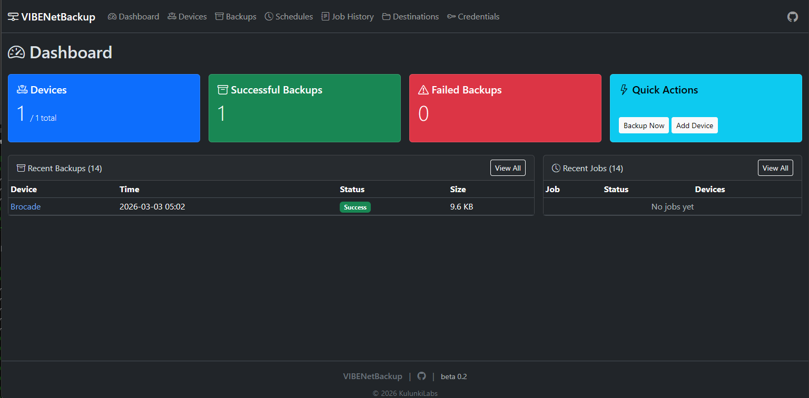

# VIBENetBackup

Network device configuration backup manager with support for multiple backup engines, storage destinations, automated scheduling, and retention policies.

**Version:** 0.2-beta  
**License:** MIT

---

## Features

- **Multi-engine backup** — Netmiko (SSH), SCP (Paramiko), Oxidized REST API, pfSense/OPNsense API
- **Multi-destination storage** — Local filesystem, Forgejo/Git, SMB/CIFS shares
- **Import from Oxidized** — Pull your entire device inventory in one click
- **Automated scheduling** — Cron-based with APScheduler
- **Retention management** — Grandfather-Father-Son (GFS) rotation
- **Change detection** — SHA256 hash comparison, unified diff viewer
- **Web UI** — Bootstrap 5 dark theme with HTMX
- **REST API** — Full JSON API at `/api/v1/*`
- **Encrypted credentials** — Fernet encryption for stored passwords
- **Security hardened** — Systemd service with NoNewPrivileges, dedicated user

---

## Installation

### Method 1: Quick Install (Recommended for Production)

One-command installation with systemd service:

```bash
curl -fsSL https://raw.githubusercontent.com/kulunkilabs/vibenetbackup/main/install.sh | sudo bash
```

**What it does:**
- Installs Python 3.11+, git, and dependencies
- Creates dedicated `vibenetbackup` system user
- Clones repo to `/opt/vibenetbackup`
- Sets up Python virtual environment
- Generates secure `.env` with random admin password
- Creates systemd service with security hardening
- Starts the service on port 5005

**Access the web UI:**
```
http://<your-server-ip>:5005
Username: admin
Password: (shown during installation)
```

**Service management:**
```bash
sudo systemctl {start|stop|restart|status} vibenetbackup
sudo journalctl -u vibenetbackup -f  # View logs
```

**Management commands:**
```bash
cd /opt/vibenetbackup
./manage.sh show-password     # Show current password
./manage.sh set-password      # Change password
./manage.sh reset-password    # Generate new random password
./manage.sh status            # Show service status
./manage.sh logs              # View logs
```

**To update:**
```bash
curl -fsSL https://raw.githubusercontent.com/kulunkilabs/vibenetbackup/main/install.sh | sudo bash
```

---

### Method 2: Git Clone + run.sh (Development/Customization)

For development, customization, or running without systemd:

```bash
git clone https://github.com/kulunkilabs/vibenetbackup.git
cd kulunkilabs
./run.sh
```

**What it does:**
- Creates Python virtual environment (`.venv`)
- Installs dependencies from `requirements.txt`
- Creates `.env` from `.env.example` if missing
- Starts server on http://localhost:5005

**For production with this method:**
```bash
cp .env.example .env
# Edit .env to set AUTH_PASSWORD, SECRET_KEY, etc.
nano .env
./run.sh
```

---

### Method 3: Docker (Containerized)

For containerized deployment:

```bash
git clone https://github.com/kulunkilabs/vibenetbackup.git
cd kulunkilabs
docker compose up -d
```

Or build and run manually:

```bash
docker build -t vibenetbackup .
docker run -d \
  -p 5005:5005 \
  -v vibenetbackup-data:/app/data \
  --name vibenetbackup \
  vibenetbackup
```

---

## Configuration

All settings are stored in `.env`:

```env
# Database
DATABASE_URL=sqlite:///./vibenetbackup.db

# Security (change these!)
SECRET_KEY=<auto-generated-fernet-key>
AUTH_USERNAME=admin
AUTH_PASSWORD=<auto-generated-password>

# Network
HOST=0.0.0.0
PORT=5005

# CORS - comma-separated allowed origins
CORS_ORIGINS=http://localhost:5005,http://127.0.0.1:5005,http://0.0.0.0:5005

# Paths
BACKUP_DIR=./backups

# Integrations
OXIDIZED_URL=http://localhost:8888

# Logging
LOG_LEVEL=INFO
```

**Important:** Change `AUTH_PASSWORD` and `SECRET_KEY` for production!

---

## First Steps

1. **Login** — Use credentials from installation (or `admin`/`changeme-strong-password` for dev)
2. **Credentials** — Add SSH credentials for your devices ( username + password or SSH key )
3. **Devices** — Add devices manually or [**Import from Oxidized**](#oxidized-integration)
4. **Test** — Click **Test All** to verify SSH connectivity
5. **Destinations** — Configure where backups are stored (local, git, SMB)
6. **Schedule** — Set up automated backups with cron expressions
7. **Retention** — Configure GFS retention policies

---

## Oxidized Integration

VIBENetBackup can import your existing device inventory from [Oxidized](https://github.com/ytti/oxidized) and use it as a backup source.

### Default Ports

| Tool | Default Port | Configuration |
|------|--------------|---------------|
| **VIBENetBackup** | `5005` | `PORT=5005` in `.env` |
| **Oxidized** | `8888` | `OXIDIZED_URL=http://localhost:8888` in `.env` |

### Import Devices from Oxidized

1. **Ensure Oxidized is running** on its default port (8888)
2. **Configure the Oxidized URL** in VIBENetBackup `.env`:
   ```env
   OXIDIZED_URL=http://localhost:8888
   ```
3. **Go to Devices → Import from Oxidized**
4. Click **Import** to pull all devices from Oxidized

### Using Oxidized as Backup Engine

VIBENetBackup can also fetch configurations via Oxidized's REST API:

1. **Add credentials** for your devices (same as Oxidized uses)
2. **Create a device** with device type set to use Oxidized engine
3. **Run backup** — VIBENetBackup will query Oxidized for the latest config

This is useful when:
- You want to migrate from Oxidized gradually
- Oxidized has better support for certain device types
- You want to use Oxidized's collection but VIBENetBackup's storage/retention

---

## pfSense / OPNsense Integration

VIBENetBackup supports backing up pfSense and OPNsense firewalls via their web APIs. Both are FreeBSD-based and use the `pfsense` backup engine.

### OPNsense Setup

OPNsense uses **API key/secret** pairs — regular web UI credentials will not work.

1. **Create an API key** in OPNsense:
   - Log into the OPNsense web UI
   - Go to **System > Access > Users**
   - Edit the backup user (or create a dedicated one)
   - Scroll to **API keys**, click **+** to generate a new key pair
   - Save the downloaded `apikey.txt` — it contains the key and secret
2. **Assign the required privilege:**
   - Edit the user (or its group) and add the **Diagnostics: Configuration History** privilege
   - This grants access to the `/api/core/backup/` endpoints
3. **Add credential** in VIBENetBackup:
   - **Username:** the API key (e.g. `w86XNZob/8Oq8aC5r0kbNarNtdpo...`)
   - **Password:** the API secret (e.g. `XeD26XVrJ5ilAc/EmglCRC+0j2e5...`)
4. **Add device:**
   - **Device type:** OPNsense Firewall (FreeBSD)
   - **Backup engine:** pfSense/OPNsense (API)
   - **Port:** 443 (or your custom web UI port)
   - Assign the credential from step 3

### pfSense Setup

pfSense supports two API methods. The engine tries both automatically:

**Option A — pfSense REST API package (recommended):**
1. Install the [pfSense REST API](https://pfrest.org/) package on your firewall
2. Create an API user or use an existing admin account
3. **Add credential** in VIBENetBackup with the API username and password
4. The engine will use `/api/v1/config/backup`

**Option B — PHP endpoint (no package needed):**
1. **Add credential** with your pfSense web UI username and password
2. **Required privilege:** The user must have the **WebCfg - Diagnostics: Backup & Restore** privilege
   - Go to **System > User Manager > Edit User > Effective Privileges**
   - Add `WebCfg - Diagnostics: Backup & Restore` (or use an admin account)
3. The engine will use `/diag_backup.php` with CSRF token handling

**Add device:**
- **Device type:** pfSense Firewall (FreeBSD)
- **Backup engine:** pfSense/OPNsense (API)
- **Port:** 443 (or your custom web UI port)
- Assign the credential

### Troubleshooting

| Error | Cause | Fix |
|-------|-------|-----|
| **401 — Authentication failed** (OPNsense) | Using web UI credentials instead of API key/secret | Create API key in System > Access > Users > API keys |
| **401 — Authentication failed** (pfSense) | Wrong username or password | Verify web UI credentials or REST API credentials |
| **403 — Access denied** (OPNsense) | API key works but user lacks privilege | Add **Diagnostics: Configuration History** to the user (System > Access > Users > Effective Privileges) |
| **403 — Access denied** (pfSense) | User lacks backup privilege | Add **WebCfg - Diagnostics: Backup & Restore** to the user (System > User Manager > Effective Privileges) |
| **Connection timeout** | Wrong IP, port, or firewall blocking access | Verify the IP and web UI port, check firewall rules |
| **SSL error then HTTP fallback** | Normal — HTTPS tried first, falls back to HTTP | No action needed (or configure HTTPS on the firewall) |

### Notes

- **HTTPS/HTTP:** The engine tries HTTPS first and falls back to HTTP automatically
- **Self-signed certificates:** Accepted by default (common on firewall web UIs)
- **SSH fallback:** If you set the backup engine to Netmiko (SSH) instead, it will use `cat /cf/conf/config.xml` (pfSense) or `cat /conf/config.xml` (OPNsense) over SSH
- **Custom ports:** Set the port field to match your firewall's web UI port (e.g. 8443)

---

## Supported Devices

| Vendor | Netmiko Type | Config Command |
|--------|--------------|----------------|
| Brocade/Ruckus ICX | `ruckus_fastiron` | `show running-config` |
| Nokia SR OS 7750 | `nokia_sros` | `admin display-config` |
| Nokia SR OS MD-CLI | `nokia_sros_md` | `admin show configuration` |
| Cisco IOS/XE/XR/NX-OS | `cisco_ios` / `cisco_xe` / `cisco_xr` / `cisco_nxos` | `show running-config` |
| HP ProCurve / Aruba | `hp_procurve` | `show running-config` |
| HP Comware | `hp_comware` | `display current-configuration` |
| Dell OS6/OS9/OS10 | `dell_os6` / `dell_os9` / `dell_os10` | `show running-config` |
| Dell Force10 | `dell_force10` | `show running-config` |
| QuantaMesh | `quanta_mesh` | `show running-config` |
| Arista EOS | `arista_eos` | `show running-config` |
| Juniper JunOS | `juniper_junos` | `show configuration \| display set` |
| pfSense | `pfsense` | API or `cat /cf/conf/config.xml` |
| OPNsense | `opnsense` | API or `cat /conf/config.xml` |

Adding a new device type is one line in `app/models/device.py` — no migration needed.

---

## API Examples

### Authentication
All API requests require HTTP Basic Auth:

```bash
# Set credentials
AUTH="admin:your-password"

# List devices
curl -u "$AUTH" http://localhost:5005/api/v1/devices

# Create device
curl -u "$AUTH" -X POST http://localhost:5005/api/v1/devices \
  -H "Content-Type: application/json" \
  -d '{
    "hostname": "switch01",
    "ip_address": "192.0.2.1",
    "device_type": "cisco_ios",
    "credential_id": 1
  }'

# Trigger backup
curl -u "$AUTH" -X POST http://localhost:5005/api/v1/backups/trigger \
  -H "Content-Type: application/json" \
  -d '{"device_ids": [1]}'

# List backups
curl -u "$AUTH" http://localhost:5005/api/v1/backups

# Run retention sweep
curl -u "$AUTH" -X POST http://localhost:5005/api/v1/retention/sweep
```

---

## Security

### Authentication
- HTTP Basic Auth required for all endpoints
- Default credentials auto-generated during install (save them!)
- Change default password in `.env`: `AUTH_PASSWORD=your-strong-password`

### HTTPS/SSL (Recommended for Production)
Use a reverse proxy like Nginx:

```nginx
server {
    listen 443 ssl http2;
    server_name backup.yourdomain.com;
    
    ssl_certificate /path/to/cert.pem;
    ssl_certificate_key /path/to/key.pem;
    
    location / {
        proxy_pass http://localhost:5005;
        proxy_set_header Host $host;
        proxy_set_header X-Real-IP $remote_addr;
    }
}
```

Or use Let's Encrypt with Certbot.

### System Hardening (install.sh method)
The systemd service runs with:
- Dedicated `vibenetbackup` user (no login shell)
- `NoNewPrivileges=true` — cannot gain privileges
- `ProtectSystem=strict` — read-only system files
- `ProtectHome=true` — cannot access user homes
- `PrivateTmp=true` — isolated /tmp
- `.env` and database files: `600` permissions

### Network Security
- Restrict CORS origins in `.env` (comma-separated)
- Bind to localhost only if using reverse proxy: `HOST=127.0.0.1`
- Use firewall rules to restrict access:
  ```bash
  sudo ufw allow from 198.51.100.0/24 to any port 5005
  ```

---

## Uninstallation

### Quick Uninstall

```bash
curl -fsSL https://raw.githubusercontent.com/kulunkilabs/vibenetbackup/main/uninstall.sh | sudo bash
```

**Options:**
- Keeps backup data and database by default
- Asks before removing service user
- Use `--remove-data` equivalent by answering 'n' to keep data prompt

### Manual Uninstall

```bash
# Stop service
sudo systemctl stop vibenetbackup
sudo systemctl disable vibenetbackup

# Remove files
sudo rm -f /etc/systemd/system/vibenetbackup.service
sudo rm -rf /opt/vibenetbackup

# Remove user (optional)
sudo userdel vibenetbackup

# Reload systemd
sudo systemctl daemon-reload
```

---

## Troubleshooting

**Service fails to start:**
```bash
sudo journalctl -u vibenetbackup -f
```

**Permission denied on backups:**
```bash
sudo chown -R vibenetbackup:vibenetbackup /opt/vibenetbackup/backups
```

**Show or change admin password:**
```bash
cd /opt/vibenetbackup

# Show current password
./manage.sh show-password

# Change password interactively
./manage.sh set-password

# Generate new random password
./manage.sh reset-password

# Show service status
./manage.sh status

# View logs
./manage.sh logs
```

Or manually edit `.env`:
```bash
sudo nano /opt/vibenetbackup/.env
sudo systemctl restart vibenetbackup
```

**Database locked:**
```bash
# Check for zombie processes
sudo lsof /opt/vibenetbackup/vibenetbackup.db
sudo kill -9 <pid>
```

---

## Project Structure

```
kulunkilabs/
├── app/
│   ├── main.py              # FastAPI entry point
│   ├── config.py            # Settings management
│   ├── database.py          # SQLAlchemy setup
│   ├── version.py           # Version info
│   ├── models/              # Database models
│   ├── routers/             # API routes
│   ├── modules/             # Backup engines, scheduler
│   ├── templates/           # Jinja2 templates
│   └── static/              # CSS, JS, images
├── install.sh               # Production installer
├── uninstall.sh             # Uninstaller
├── manage.sh                # Password & service management
├── run.sh                   # Development runner
├── Dockerfile
├── docker-compose.yml
├── requirements.txt
├── pyproject.toml
├── README.md
└── LICENSE
```

---

## Contributing

Contributions welcome! Please:
1. Fork the repository
2. Create a feature branch
3. Make your changes
4. Submit a pull request

---

## License

MIT License — see LICENSE file for details.

---

## Screenshots

<p align="center">
  
  <br/>
  <em>VIBENetBackup Web Interface - Dashboard with backup statistics, device overview, and quick actions</em>
</p>

## Sponsor

If you find VIBENetBackup useful, consider supporting its development:

[](https://ko-fi.com/kulunkilabs)

Your support helps cover server costs and development time.

## Links

- **Repository:** https://github.com/kulunkilabs/vibenetbackup
- **Issues:** https://github.com/kulunkilabs/vibenetbackup/issues
- **Releases:** https://github.com/kulunkilabs/vibenetbackup/releases

---

<p align="center">
  <sub>© 2026 KulunkiLabs | Built with FastAPI, SQLAlchemy, and Bootstrap</sub>
</p>
