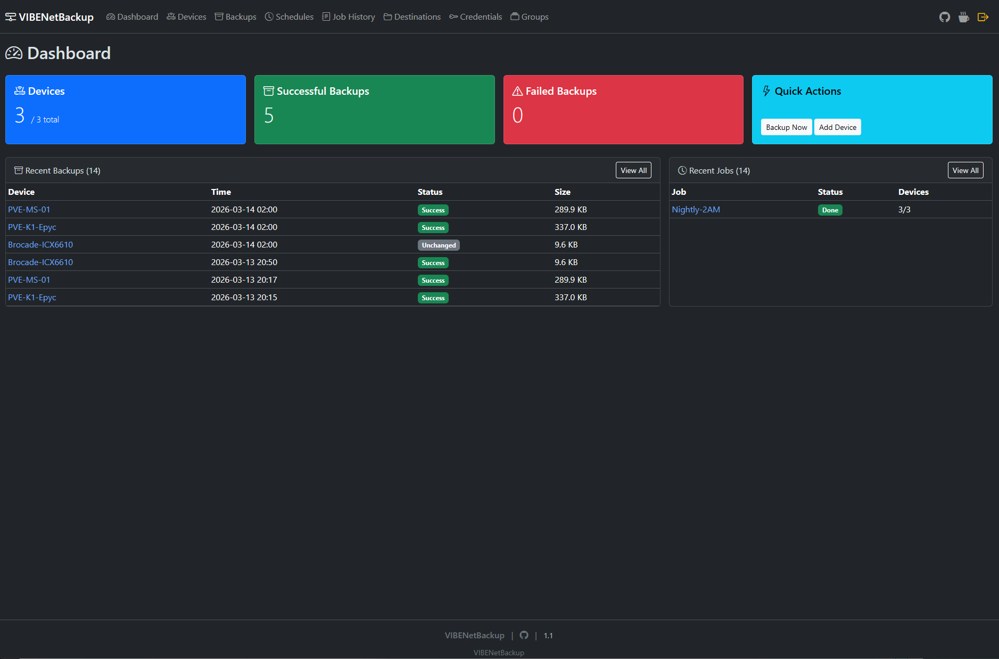
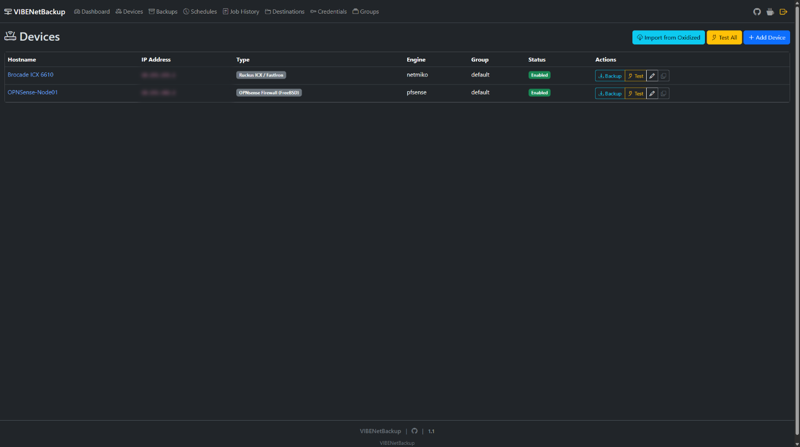
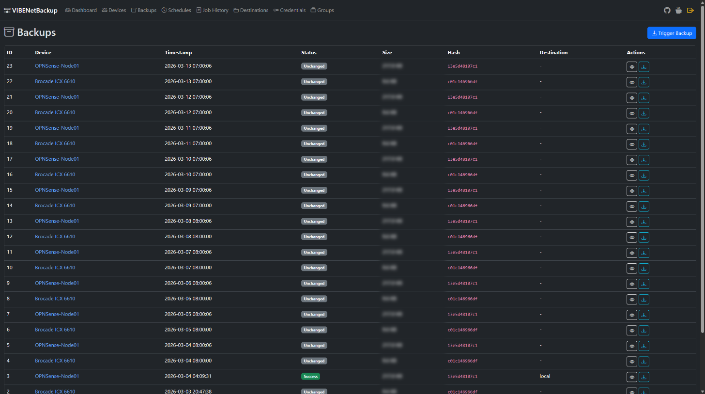
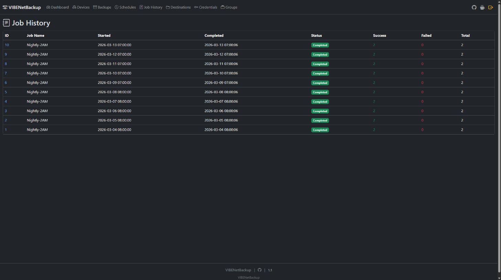

# VIBENetBackup

Network device configuration backup manager with multi-engine support, automated scheduling, and retention policies.

**Version:** 1.6.7 | **License:** MIT

<p align="center">
  
</p>

---

## Features

- **Multi-engine backup** — Netmiko (SSH), SCP, Oxidized REST API, pfSense/OPNsense API, Proxmox VE
- **Multi-destination storage** — Local, Git (GitHub/Gitea/Forgejo), SMB/CIFS with optional gzip compression
- **Automated scheduling** — Cron-based jobs with APScheduler
- **Retention management** — Grandfather-Father-Son (GFS) rotation with automatic daily maintenance
- **Notifications** — Apprise-powered alerts (Slack, Discord, Telegram, email, 100+ services)
- **Database maintenance** — Automated retention sweep, history purge, stale cleanup, SQLite VACUUM
- **Change detection** — SHA256 hash comparison with unified diff viewer
- **Web UI** — Bootstrap 5 dark theme with HTMX live updates
- **REST API** — Full JSON API at `/api/v1/*`
- **Cookie-based auth** — 14-day sessions with HMAC-SHA256 signed tokens
- **Encrypted credentials** — Fernet encryption for stored passwords
- **SSH Proxy / Jump Host** — Back up devices at remote sites through a bastion/jump host (autossh, ProxyJump)
- **Import from Oxidized** — Pull your device inventory in one click
- **Device groups** — Organize devices and credentials by group

---

## Quick Start

### Docker (recommended)

```bash
mkdir vibenetbackup && cd vibenetbackup
curl -fsSL https://raw.githubusercontent.com/kulunkilabs/vibenetbackup/main/docker/image/docker-compose.yml -o docker-compose.yml
# Edit docker-compose.yml — change SECRET_KEY and AUTH_PASSWORD
docker compose up -d
```

### One-liner install (Linux with systemd)

```bash
curl -fsSL https://raw.githubusercontent.com/kulunkilabs/vibenetbackup/main/install.sh | sudo bash
```

Open `http://<your-server-ip>:5005` — default credentials are shown during install.

> Full installation guide: [docs/INSTALL.md](docs/INSTALL.md)

---

## Screenshots

<p align="center">
  <br/>
  <em>Dashboard — device stats, recent backups, job status</em>
</p>

<p align="center">
  <br/>
  <em>Devices — manage, test, backup with one click</em>
</p>

<p align="center">
  <br/>
  <em>Backups — full history with hash, status, diff viewer</em>
</p>

<p align="center">
  <br/>
  <em>Job History — scheduled backup run results</em>
</p>

---

## Supported Devices

| Vendor | Types |
|--------|-------|
| **Cisco** | IOS, IOS-XE, IOS-XR, NX-OS |
| **Nokia** | SR OS Classic CLI, SR OS MD-CLI (7750/7210/7450/7705) |
| **Brocade/Ruckus** | ICX / FastIron |
| **Arista** | EOS |
| **Juniper** | JunOS |
| **HP/Aruba** | ProCurve, Comware |
| **Dell** | OS6, OS9, OS10, Force10 |
| **MikroTik** | RouterOS (`/export`) |
| **pfSense/OPNsense** | API backup |
| **Proxmox VE** | SSH/SFTP config collection (90+ files, stored as tar.gz) |

> Device setup guides and troubleshooting: [docs/DEVICES.md](docs/DEVICES.md)

---

## Documentation

| Doc | Description |
|-----|-------------|
| [docs/INSTALL.md](docs/INSTALL.md) | Installation methods, Docker, upgrades, uninstall |
| [docs/CONFIGURATION.md](docs/CONFIGURATION.md) | Environment variables, secrets, CORS, HTTPS, security |
| [docs/DEVICES.md](docs/DEVICES.md) | Supported devices, setup guides, vendor-specific notes |
| [docs/API.md](docs/API.md) | REST API reference with curl examples |
| [SECURITY.md](SECURITY.md) | Security features, hardening, incident response |

---

## Changelog

### v1.6.7 (2026-04-23)
- **Per-device backup history** — new timeline view at `/backups/device/<id>/history` with "First / Changed / Unchanged" markers computed from config hash, and checkboxes to pick any two revisions to compare
- **Diff-any-two-backups view** — new compare page at `/backups/compare?a=<id>&b=<id>` renders a unified diff between arbitrary backups of the same device; handles identical-config, archive-bundle, and a/b-order-swap cases
- **Manual backup now honors destination selection** — the trigger form gained a destination checkbox group; the POST handler accepts `destination_ids` so manual runs write to the destinations you pick instead of falling back to "first local"
- **Multi-destination recording** — when a backup writes to multiple destinations (e.g. local + SMB), the `Backup` row now records all of them (`destination_type` = `"local, smb"`), displayed as colored badges in the list / detail / history views. Previously only the last successful destination showed
- **Proxmox → SMB / remote destinations** — binary/archive backups (Proxmox tarballs) now ship to every selected destination, not only local. New optional `save_binary(hostname, data, extension, config)` method on `DestinationBackend`; `LocalDestination` and `SMBDestination` implement it; git-family destinations are skipped with a warning (archives in git are unusual)
- **`.dockerignore`** — added to keep `.env`, `staging*.db`, `ssh_keys/`, `backups/`, `venv/`, `.git/`, and test caches out of the Docker build context

### v1.5.7 (2026-04-10)
- **SSH Proxy / Jump Host** — Netmiko and SCP engines can now connect through a bastion/jump host before reaching the target device. Useful for remote sites where devices are only reachable via an intermediate SSH server (e.g. autossh tunnels). Configure per device: proxy host, proxy port, and optionally a separate proxy credential when the jump host uses different credentials than the device
- **Separate proxy credentials** — Jump host and target device can authenticate with different username/password pairs, reusing the existing encrypted credential store
- **Oxidized engine** — fetches configs by device hostname instead of IP address, required for jump-host setups where multiple devices share the same jump-host IP
- **Oxidized import** — captures port from Oxidized node data; non-22 ports (jump-host forwarded ports) shown highlighted in the import table
- **Alembic migration fix** — `alembic upgrade head` now correctly reads `DATABASE_URL` from the environment or `.env` file, fixing Docker upgrades where the database path differs from the `alembic.ini` default

### v1.5.6 (2026-03-27)
- **Apprise notifications** — new Notifications tab with CRUD, encrypted URL storage, test button; supports Slack, Discord, Telegram, email (Gmail, Outlook, corporate SMTP relay), and 100+ services
- **Backup compression** — optional gzip for Local and SMB destinations (`"compress": true` or checkbox in destination form)
- **MikroTik RouterOS** support via Netmiko SSH (`/export`)
- **Always save backups** — removed misleading "unchanged" status; every backup is now saved to disk
- **Friendly destination form** — replaced raw JSON with proper form fields per destination type (local, SMB, Git) with dynamic auth method selection
- **Database maintenance** — automated daily job at 3:30 AM: retention sweep, stale backup cleanup, job history purge (90 days), SQLite VACUUM
- **Timezone fix** — all timestamps display in local time (from `TZ` env var) instead of UTC
- **Email setup guide** — documentation for Gmail, Outlook, corporate relay (port 25 no auth), SMTP with TLS

### v1.5.5 (2026-03-23)
- Backups page: search by device name, filter by status
- Checkbox selection with batch delete (select all / individual)
- Batch action bar with count, select all on page, deselect, delete
- Pagination preserves search and filter state

### v1.5.4 (2026-03-23)
- Pagination on Backups and Job History pages (10/25/50 per page)
- Delete failed job runs from dashboard and history
- Delete failed backups from backup list

### v1.5.2 (2026-03-23)
- Proxmox: switched from ZIP to tar.gz to preserve symbolic links
- Seed default Git and SMB destinations (disabled) on startup
- Destinations panel on dashboard showing all configured destinations
- Destination column in dashboard recent backups
- Archive viewer supports both zip and tgz formats

### v1.5.1 (2026-03-23)
- Fix Cisco enable mode: call `conn.enable()` before running commands when enable secret is configured

### v1.5 (2026-03-23)
- Fix Nokia SR OS: map `nokia_sros_md` to `nokia_sros` netmiko driver
- Protect credentials across upgrades: persist and guard `SECRET_KEY`

---

## Support

If you find VIBENetBackup useful, consider buying me a coffee:

<a href="https://ko-fi.com/kulunkilabs" target="_blank">
  
</a>

---

## Acknowledgments

Special thanks to **Peter B.** for his dedication as our lead tester — his thorough testing across diverse network environments and detailed feedback have been instrumental in shaping the reliability and quality of VIBENetBackup.

---

## Contributing

Contributions welcome! Fork the repo, create a feature branch, and submit a pull request.

## License

MIT License. See [LICENSE](LICENSE) for details.

---

## Links

- **Repository:** https://github.com/kulunkilabs/vibenetbackup
- **Issues:** https://github.com/kulunkilabs/vibenetbackup/issues
- **Releases:** https://github.com/kulunkilabs/vibenetbackup/releases

---

<p align="center">
  <sub>Built with FastAPI, SQLAlchemy, and Bootstrap</sub>
</p>
